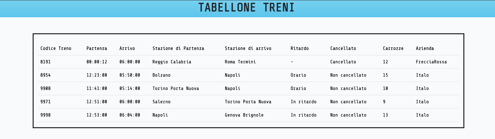

# TABELLONE TRENI

## consegna

Creiamo una tabella trains e relativa Migration, cercando di capire la natura dei campi necessari.

Ogni treno dovrà avere:

Azienda
Stazione di partenza
Stazione di arrivo
Orario di partenza
Orario di arrivo
Codice Treno
Totale Carrozze
Se in orario o meno
Se cancellato o meno

## risultato -->

